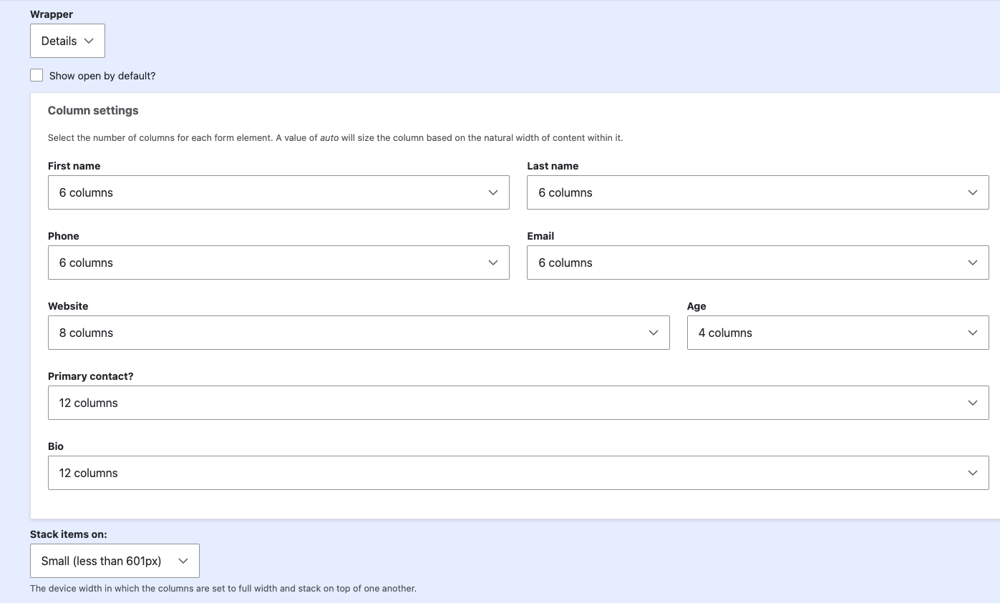

# Flexbox widget
The **Flexbox** widget (`custom_flex`) arranges subfields side-by-side using CSS
Flexbox for a more compact, responsive layout. Each subfield can be given a
specific column width, and you can optionally define a breakpoint at which the
layout automatically switches back to stacked (single-column) mode on smaller
screens.

--8<-- "field_widget.md:settings"

### Flexbox settings

- The **Columns** setting is based on a 12-column grid. Each subfield can be
  assigned a value to control its width within the row.
- The **Breakpoint** setting allows you to choose a screen size (`small` or
  `medium`) at which the flex layout automatically falls back to a
  single-column stacked layout on smaller devices.

| Setting    | Label      | Description                                                                |
|------------|------------|----------------------------------------------------------------------------|
| columns    | Columns    | Column width settings for each subfield                                    |
| breakpoint | Breakpoint | Optional responsive breakpoint where the layout falls back to stacked mode |

