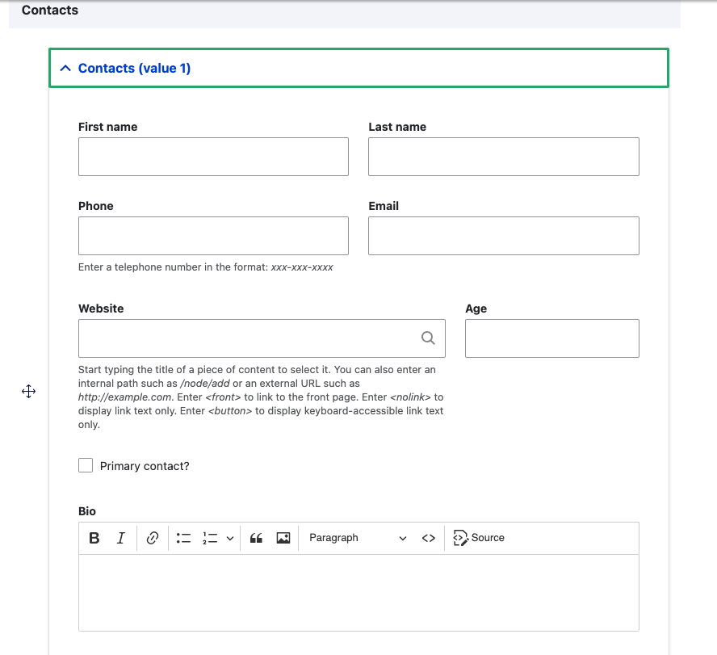

# Field widgets

The **Custom Field** module provides two primary widget types for editing
structured data: **Stacked** (the default) and **Flexbox**. Both share a common
set of global settings that control the outer wrapper behavior (`details`, 
`fieldset`, or `div`), summary labels, default open/collapsed states and 
individual subfield widget settings.

- [Stacked (default) widget](stacked.md)
- [Flexbox widget](flexbox.md)

## Configuration
1. Navigation to the **Manage form display** page for the entity type 
   containing your custom field. (e.g. 
   `/admin/structure/types/manage/page/form-display`).
2. Select a **Widget** for your field from the dropdown. [Stacked](stacked.md) is the 
   default, but [Flexbox](flexbox.md) is often a better choice for complete layout control.
3. Click the gear icon to access the widget configuration.
4. Customize the widget settings as needed.
5. **Save** the changes.

> [!tip] Grouping & Layout
> One of the most powerful features of the **Custom Field** module is the
> ability to group related fields and control their layout directly.
>
> Fields that belong together should stay together — our widgets make it simple
> and intuitive to create logical groups with clean layouts, eliminating the
> need for additional modules like *Field Group* or custom form alterations.
>
> {style="max-width: 480px"}