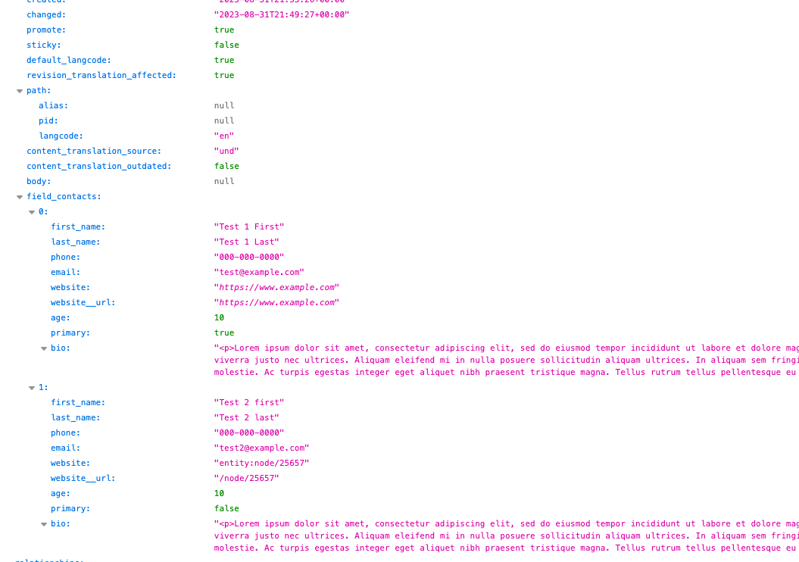

# JSON:API integration
Most subfields are available to the JSON:API module out of the box. The Custom 
Field JSON:API integration module provides additional normalizers for these
more advanced subfields that include extra properties.

## Normalizers

- `string_long`
- `entity_reference`
- `uri`
- `datetime`
- `daterange`
- `time_range`

## Dependencies
- JSON:API (`jsonapi`)
- JSON:API Custom Field (`custom_field_jsonapi`)
- (recommended) [JSON:API Image Styles]('https://www.drupal.org/project/jsonapi_image_styles'){:target="_blank"} (`jsonapi_image_styles`)

## Limitations
- No support for [JSON:API Extras](https://www.drupal.org/project/jsonapi_extras){target="_blank"} advanced configuration of subfields.
- [Entity reference](../plugins/type/entity-reference.md) subfields are exposed as full entities and do not support
  the `include` query parameter or advanced filtering.
